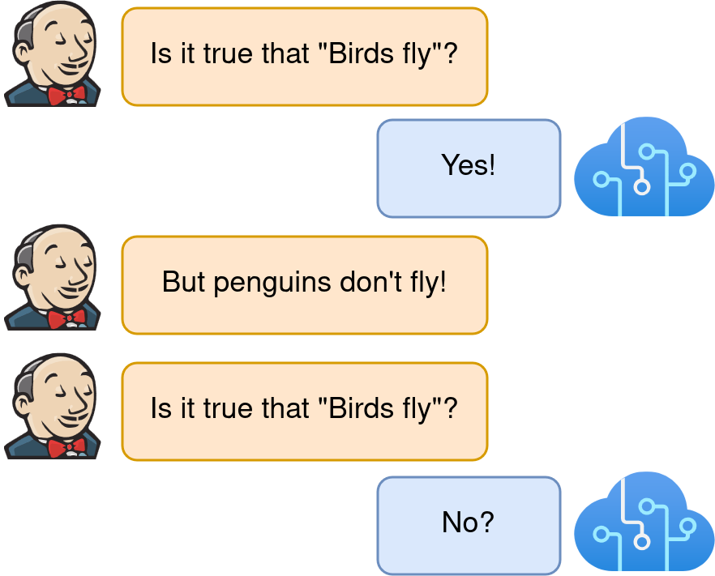

# Nonmonotonic reasoning about generics and exceptions

<p align="center">

</p>

This repository contains resources for the paper "Are LLMs classical or nonmonotonic reasoners? Lessons from generics" ACL 2024 (main).

# Data

Experiments in this paper are done on two datasets:
* Abstract generics and exemplars: `data/abstract_generics.csv`
* Commonsense generics and exemplars: [Penguins Don’t Fly: Reasoning about Generics through Instantiations and Exceptions](https://aclanthology.org/2023.eacl-main.192) (Allaway et al., EACL 2023)

# Citation

```
@inproceedings{leidinger-etal-2024-llms,
    title = "Are {LLM}s classical or nonmonotonic reasoners? Lessons from generics",
    author = "Leidinger, Alina  and
      Van Rooij, Robert  and
      Shutova, Ekaterina",
    editor = "Ku, Lun-Wei  and
      Martins, Andre  and
      Srikumar, Vivek",
    booktitle = "Proceedings of the 62nd Annual Meeting of the Association for Computational Linguistics (Volume 2: Short Papers)",
    month = aug,
    year = "2024",
    address = "Bangkok, Thailand",
    publisher = "Association for Computational Linguistics",
    url = "https://aclanthology.org/2024.acl-short.51/",
    doi = "10.18653/v1/2024.acl-short.51",
    pages = "558--573",
    abstract = "Recent scholarship on reasoning in LLMs has supplied evidence of impressive performance and flexible adaptation to machine generated or human critique. Nonmonotonic reasoning, crucial to human cognition for navigating the real world, remains a challenging, yet understudied task. In this work, we study nonmonotonic reasoning capabilities of seven state-of-the-art LLMs in one abstract and one commonsense reasoning task featuring generics, such as {\textquoteleft}Birds fly', and exceptions, {\textquoteleft}Penguins don`t fly' (see Fig. 1). While LLMs exhibit reasoning patterns in accordance with human nonmonotonic reasoning abilities, they fail to maintain stable beliefs on truth conditions of generics at the addition of supporting examples ({\textquoteleft}Owls fly') or unrelated information ({\textquoteleft}Lions have manes').Our findings highlight pitfalls in attributing human reasoning behaviours to LLMs as long as consistent reasoning remains elusive."
}
```
